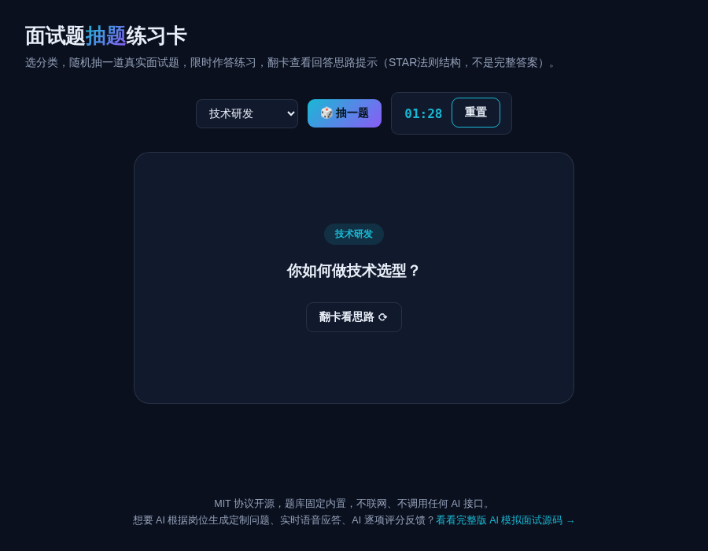

# 面试题抽题练习卡 · Interview Flashcards

**[在线体验 →](https://anna123123123-creator.github.io/interview-cards/)**

免费开源、纯浏览器运行的面试题抽题练习工具。选分类（产品经理 / 技术研发 / 市场营销 / 通用行为面试），随机抽一道真实面试题，90 秒倒计时限时作答练习，翻卡查看回答思路提示（STAR 法则结构，不是完整答案）。不联网，不调用任何 AI 接口。



## 试用方法

直接用浏览器打开 `index.html`，或用静态文件服务器跑起来：

```bash
python3 -m http.server 8000
```

## 题库

内置 4 大分类共 22 道真实面试题，每道题附一句"回答思路"提示（多数按 STAR 结构：情景-任务-行动-结果），帮你练习组织答案的框架，不是替你写好答案。

## 协议

MIT。

## 相关项目

这个是做 **AI 模拟面试**产品时顺手做的免费小工具——题库固定、思路提示是静态文本，不会根据你的回答给反馈。完整版是 AI 根据岗位定制生成问题、实时语音应答、AI 逐项评分反馈，源码在这：[全能源码 · AI 模拟面试网站源码](https://inzyxuashop.com/aimianshi-yuanma.html)。
